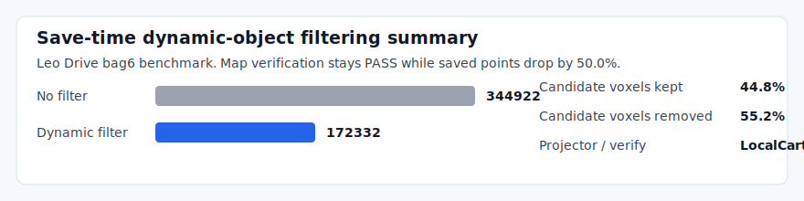

lidarslam_ros2
====

ROS 2 LiDAR SLAM focused on non-GPL pointcloud-map authoring, benchmarking, and compatibility with Autoware pointcloud-map workflows.

> Status: `develop` tracks the current `v2 alpha` line.
> For the latest tagged public beta, see [v0.2.2 Release Notes](docs/releases/v0.2.2.md).
## Recommended Public Workflow

The recommended public path in this repository is:

- frontend: `RKO-LIO`
- backend: `graph_based_slam`
- output: Autoware-compatible `pointcloud_map/` and `map_projector_info.yaml`

This is the path exercised in the public quickstart, benchmark flow, and release/readiness gate.

## Scope

This repository is for people who want:

- ROS 2 LiDAR SLAM with loop closure
- pointcloud maps that Autoware can load
- lanelet2 maps auto-generated from SLAM trajectories
- end-to-end autonomous driving on self-made maps (AWSIM + Autoware)
- a non-GPL default workflow

Out of scope for the public path:

- Autoware planning/localization bringup beyond the provided demo scripts
- GPL-only frontend or backend components in the default workflow

## Why This Repo

- non-GPL default path: `graph_based_slam`, `scanmatcher`, `RKO-LIO`, `DLIO`, and optional `FAST_GICP`
- pointcloud-map authoring is treated as a first-class workflow, not just a side-effect of odometry
- Autoware pointcloud-map flow is exercised end-to-end
- **AWSIM → lidarslam → Autoware autonomous driving** pipeline with one-command demo
- **lanelet2 auto-generation** from SLAM trajectories (multi-segment with shared boundary nodes)
- default benchmark path is tracked on `NTU VIRAL`
- current long-loop evidence is tracked on `MID360`
- optional GNSS georeferencing writes `map_projector_info.yaml`; GNSS edges can use covariance-based weighting
- GPL-free Scan Context place recognition is available in `graph_based_slam`
- optional MIT-licensed 3D-BBS loop-candidate verification can be built from the vendored `Thirdparty/3d_bbs` source and remains disabled at runtime by default
- report helpers cover benchmarks, GNSS, cleanup, dynamic filtering, place recognition, and submission bundles

## Install

Clone with submodules and install dependencies:

```bash
cd ~/ros2_ws/src
git clone --recursive https://github.com/rsasaki0109/lidarslam_ros2.git
cd ..
rosdep install --from-paths src --ignore-src -r -y
```

If you already cloned without submodules:

```bash
git -C src/lidarslam_ros2 submodule update --init --recursive
```

Build the workspace:

```bash
colcon build --symlink-install --cmake-args -DCMAKE_BUILD_TYPE=Release
```

## Quickstart

```bash
# local checks
bash scripts/run_default_ci_checks.sh

# fixed public quickstart
bash scripts/download_ntu_viral_tnp01.sh
bash scripts/run_autoware_quickstart.sh

# arbitrary rosbag2
bash scripts/run_autoware_map_beginner.sh /path/to/rosbag2
```

## AWSIM Autonomous Driving Pipeline

AWSIM simulator data can flow through lidarslam into `pointcloud_map`, generated lanelet2, and Autoware driving demos. Start with:

```bash
bash scripts/test_awsim_setup.sh
bash scripts/run_awsim_selfmade_map_demo.sh
```

For map packaging, lanelet2 generation, and terminal-by-terminal bringup, see [AWSIM Autonomous Driving Tutorial](docs/awsim-autonomous-driving-tutorial.md).

## Point-Cloud Map Example
Autoware-compatible browser proof built from a live `/map/pointcloud_map`: the rendered map comes from Autoware map loaders, map verify is `PASS`, and GNSS runs emit `LocalCartesian`.

Save-time dynamic-object filtering on Leo Drive `bag6` cuts saved points by about `50%` while keeping verification `PASS`.


## Docs
- [AWSIM Autonomous Driving Tutorial](docs/awsim-autonomous-driving-tutorial.md)
- [Autoware-Compatible Map Authoring](docs/autoware-map-authoring.md) / [Autoware Quickstart](docs/autoware-quickstart.md) / [Autoware Foxglove](docs/autoware-foxglove.md)
- [Operator Workflows](docs/workflows.md)
- [Benchmarking And Release Gate](docs/benchmarking.md)
- [Comparison](docs/comparison.md)
- [v0.2.2 Release Notes](docs/releases/v0.2.2.md)
- [Contributing](CONTRIBUTING.md)
- [Changelog](CHANGELOG.md)
- [Releasing](RELEASING.md)

Preview the doc site locally with `python3 -m mkdocs serve`.

## Current Snapshot

The current public evidence covers `NTU VIRAL`, `MID360`, GNSS map metadata, and dynamic-filter save-time cleanup. More detail lives in [docs/comparison.md](docs/comparison.md), [docs/benchmarking.md](docs/benchmarking.md), `output/benchmark_summary.md`, and `output/latest_report.html`.

## Main Entrypoints

Required input topics for the main public path:

| Launch path | Required topics | Optional topics |
| --- | --- | --- |
| `ros2 launch lidarslam rko_lio_slam.launch.py` | LiDAR `sensor_msgs/PointCloud2` on `lidar_topic`, IMU `sensor_msgs/Imu` on `imu_topic` | `sensor_msgs/NavSatFix` on `gnss_topic` (default: `/gnss/fix`) when `use_gnss:=true` |
| `ros2 launch lidarslam lidarslam.launch.py` | Point cloud `sensor_msgs/PointCloud2` on `input_cloud`, TF from `robot_frame_id` to the LiDAR frame | IMU on `imu_topic` when `scanmatcher use_imu:=true`, odom TF when `scanmatcher use_odom:=true`, GNSS on `gnss_topic` (default: `/gnss/fix`) when backend `use_gnss:=true` |
| `ros2 launch graph_based_slam graphbasedslam.launch.py` | `lidarslam_msgs/MapArray` on `map_array` | IMU on `/imu` when `use_imu_preintegration:=true`, GNSS on `gnss_topic` (default: `/gnss/fix`) when `use_gnss:=true` |

There is no wheel-speed / vehicle-speed input in the current public path yet.
The backend GNSS subscription topic is configurable with `gnss_topic` (default: `/gnss/fix`). Inspect covariance with `scripts/inspect_navsatfix_covariance.py`; Applanix conversion details live in [docs/workflows.md](docs/workflows.md).

Run the public Autoware quickstart:

```bash
bash scripts/run_autoware_quickstart.sh
```

Run `RKO-LIO + graph_based_slam` directly:

```bash
ros2 launch lidarslam rko_lio_slam.launch.py \
  bag_path:=/path/to/rosbag2 \
  lidar_topic:=/os_cloud_node/points \
  imu_topic:=/os_cloud_node/imu
```

Save the current map:

```bash
ros2 service call /map_save std_srvs/srv/Empty
```

To filter likely dynamic objects only in the saved map output, enable `use_dynamic_object_filter: true` and tune `dynamic_object_filter_voxel_size`, `dynamic_object_filter_min_observations`, `dynamic_object_filter_temporal_window`, and `dynamic_object_filter_max_range_from_sensor_m` before calling `/map_save`.

Run the standard benchmark path:

```bash
bash scripts/download_ntu_viral_tnp01.sh
bash scripts/run_rko_lio_graph_benchmark.sh
```

For KITTI Odometry / Velodyne-only evaluation, Leo Drive classic-path suites, dynamic-filter benchmarks, and MID360 place-recognition comparisons, use the entrypoints documented in [docs/benchmarking.md](docs/benchmarking.md).

Run the local readiness gate:

```bash
bash scripts/run_release_readiness_checks.sh --ape-threshold 0.10
```

## License Policy

The default public workflow excludes GPL-only frontend/backend components. `graph_based_slam` is BSD-2-Clause; `RKO-LIO`, `DLIO`, and optional vendored `3D-BBS` are MIT; `FAST_GICP` is BSD-3-Clause; built-in `Scan Context` is implemented locally. `Thirdparty/lio-sam` and `Thirdparty/3d_bbs` are excluded from direct `colcon` package discovery via `COLCON_IGNORE`.

## Support Matrix

| ROS 2 distro | Ubuntu | Scope |
| --- | --- | --- |
| Humble | 22.04 | default workflow build and package tests in CI |
| Jazzy | 24.04 | default workflow build and package tests in CI; Autoware pointcloud-map dogfood exercised locally |

## Quality Gates

The main checks for the public path are `bash scripts/run_default_ci_checks.sh`, `python3 scripts/verify_autoware_map.py <pointcloud_map_dir>`, `bash scripts/run_autoware_quickstart.sh`, `bash scripts/run_rko_lio_graph_autoware_dogfood.sh --auto-exit-secs 20`, and `bash scripts/run_release_readiness_checks.sh --ape-threshold 0.10`.

For the command-level details, parameter-file pointers, and Autoware map output notes, see [docs/workflows.md](docs/workflows.md).
